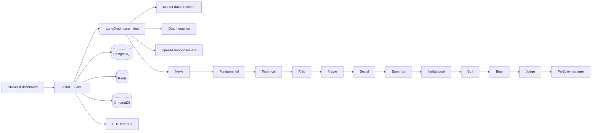

# FinAgent AI

[](https://github.com/theTanmayAgarwal/FinAgent-AI/actions/workflows/ci.yml)
[](https://www.python.org/)
[](https://www.langchain.com/langgraph)
[](https://fastapi.tiangolo.com/)
[](https://finagent-ai-dashboard.onrender.com/)

FinAgent AI is a production-oriented, explainable stock-market research platform that models a professional investment committee with 12 LangGraph agents. It produces a scored BUY/HOLD/SELL view, competing bull and bear cases, an auditable evidence trail, a confidence score, a risk-aware allocation suggestion and a downloadable PDF.

> Educational software, not investment advice. Live commercial use requires licensed point-in-time data, security/compliance review, model evaluation and human oversight.

## Live deployment

- **Application:** [finagent-ai-dashboard.onrender.com](https://finagent-ai-dashboard.onrender.com/)
- **API documentation:** [finagent-ai-api.onrender.com/docs](https://finagent-ai-api.onrender.com/docs)
- **Health endpoint:** [finagent-ai-api.onrender.com/health](https://finagent-ai-api.onrender.com/health)

The free Render services can take about a minute to wake after inactivity. Create a local account in the application sidebar, then select an NSE/BSE ticker and run the investment committee.

## What is included

- 12-agent LangGraph committee: news, fundamentals, technicals, risk, macro, social, earnings calls, institutional activity, bull, bear, judge and portfolio manager
- Quantitative indicators: RSI, MACD, Bollinger Bands, EMA, SMA, VWAP, support/resistance, beta, VaR, Sharpe, Sortino and maximum drawdown
- Fundamental scoring across growth, returns, leverage, cash flow and valuation
- Backtesting and seeded Monte Carlo portfolio simulation
- OpenAI Responses API narrative synthesis, with a deterministic no-key fallback
- FastAPI REST service, JWT authentication, ownership-scoped reports and OpenAPI docs
- PostgreSQL persistence, Redis-ready cache adapter and ChromaDB research memory
- Streamlit dashboard and PDF reports
- Docker Compose, Prometheus metrics, structured JSON logging and GitHub Actions CI
- Deterministic demo data, sample dataset/report and unit/integration tests

## Architecture



Each agent writes an `Evidence` object containing a summary, normalized score, confidence, metrics, sources and explicit risks. The judge uses declared weights—fundamental 25%, risk 18%, technical 15%, news/macro/earnings 10% each, institutional 8%, social 4%—rather than opaque majority voting. OpenAI is limited to grounded narrative synthesis; numeric decisions remain deterministic and testable.

## Quick start

### Docker (recommended)

```bash
cp .env.example .env
# Set a long SECRET_KEY; add OPENAI_API_KEY if desired.
docker compose up --build
```

Open:

- Dashboard: `http://localhost:8501`
- API docs: `http://localhost:8000/docs`
- Health: `http://localhost:8000/health`
- Prometheus: `http://localhost:9090`

### Python

```bash
python -m venv .venv
source .venv/bin/activate
pip install -e '.[dev]'
cp .env.example .env
# For a dependency-free local database, set DATABASE_URL=sqlite:///./finagent.db
uvicorn finagent.api.main:app --reload
# second terminal
streamlit run finagent/ui/app.py
```

After the first installation, the simplest way to launch both services is:

```bash
./scripts/start.sh
```

Press `Control+C` once to stop the dashboard and any API process started by the script.

Run quality checks with `make lint test`.

## Repository layout

```text
finagent/
  agents/       LangGraph state, graph and 12 committee nodes
  api/          FastAPI application and versioned routes
  core/         settings, security and structured logging
  db/           SQLAlchemy models and sessions
  quant/        indicators, risk, backtest and Monte Carlo
  schemas/      validated API/domain contracts
  services/     market data, OpenAI, PDF, Redis and Chroma adapters
  ui/           Streamlit dashboard
data/           sample input data and local vector storage
docs/           API, deployment and SQL schema
reports/        sample report
tests/          quant, committee and API flows
```

## Configuration

All configuration is environment-driven; see `.env.example`. `MARKET_DATA_MODE=demo` is deterministic and offline. `live` activates the yfinance adapter as a convenient demonstration only—not a licensed institutional feed. `OPENAI_API_KEY` enables a grounded thesis written through the Responses API; absent a key, the deterministic committee still returns a complete report.

## Extending data sources

Implement a provider with `fetch(ticker) -> MarketSnapshot` and select it in `get_market_provider`. Production adapters should add timeouts, retries with jitter, circuit breaking, entitlement enforcement, raw-response lineage, point-in-time timestamps and quality flags. The social and ownership demo inputs deliberately carry low confidence so missing premium feeds cannot masquerade as strong evidence.

## Security and limitations

Passwords are bcrypt-hashed and report reads are owner-scoped. The API validates tickers and portfolio weights; the container runs as a non-root user. This portfolio project is a robust foundation, not a turnkey regulated adviser: add rate limits, managed identity, database migrations, background jobs, licensed data, audit controls, model evaluations and jurisdiction-specific compliance before real-money use.

See [API documentation](docs/API.md), [deployment guide](docs/DEPLOYMENT.md), [database schema](docs/schema.sql), and the [sample report](reports/sample_report.md).
